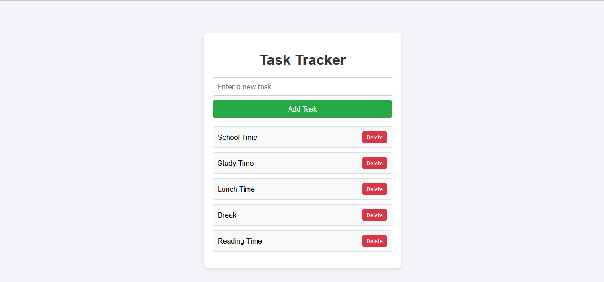

# Task Tracker



A simple and effective Task Tracker built with HTML, CSS, and JavaScript. This project helps users manage their daily tasks by allowing them to add and delete tasks in an intuitive interface.

## Features
- **Add Tasks**: Easily add tasks using the input field and button.
- **Delete Tasks**: Remove tasks with a single click of the "Delete" button.
- **Responsive Design**: Works seamlessly on desktop and mobile devices.

## Preview
The Task Tracker provides a clean and user-friendly design for managing tasks:


## Installation
1. Clone the repository or download the files directly:
   ```bash
   git clone https://github.com/bigprogrammers/Task_Tracker_HTML_CSS_JS
   ```
2. Navigate to the project directory:
   ```bash
   cd task-tracker
   ```
3. Open the `index.html` file in your browser to view the app.

## Usage
1. Type a task into the input field.
2. Click the "Add Task" button to add the task to the list.
3. Use the "Delete" button to remove a task when completed.

## Technologies Used
- **HTML**: Markup structure of the application.
- **CSS**: Styling for a clean and responsive design.
- **JavaScript**: Logic for adding and removing tasks.

## Contributing
Contributions are welcome! If you'd like to improve this project, please fork the repository and submit a pull request.

## License
This project is licensed under the MIT License. Feel free to use, modify, and distribute it as you like.

---

### Screenshot
